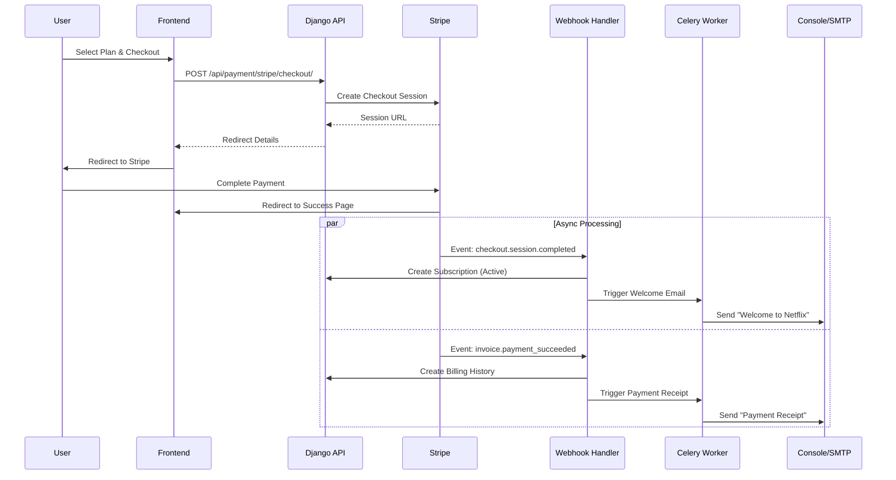

# Netflix Subscription System

A Dockerized Django application implementing a complete Netflix-like subscription system with Stripe integration, Celery background tasks, and email notifications.

## Architecture



## Prerequisites

- Python 3.10+
- Redis (for Celery)
- Stripe CLI

## Setup

1.  **Install Dependencies**
    ```powershell
    # Activate virtual environment
    .\venv_win\Scripts\activate

    pip install -r requirements.txt
    ```

2.  **Environment Configuration**
    Create a `.env` file in `netflix/`:
    ```env
    STRIPE_SECRET_KEY=sk_test_...
    STRIPE_WEBHOOK_SECRET=whsec_...
    EMAIL_BACKEND=django.core.mail.backends.console.EmailBackend
    CELERY_BROKER_URL=redis://localhost:6379/0
    ```

## Stripe Configuration

1.  **Login to Stripe**
    ```bash
    stripe login
    ```
    *Complete authentication in the browser.*

2.  **Start Webhook Forwarding**
    Run this command in a separate terminal to forward events to your local server:
    ```bash
    stripe listen --events checkout.session.completed,invoice.payment_succeeded,invoice.payment_failed,customer.subscription.updated,customer.subscription.deleted,customer.subscription.trial_will_end --forward-to http://127.0.0.1:8000/api/payment/stripe/webhook/
    ```

3.  **Update Webhook Secret**
    Copy the signing secret printed by the CLI (`whsec_...`) and update your `.env` file:
    ```env
    STRIPE_WEBHOOK_SECRET=whsec_...
    ```

## Running the Application

You need **3 separate terminal tabs** running in parallel.

> **Note:** Remember to activate the virtual environment (`.\venv_win\Scripts\activate`) and `cd netflix` in each new tab.

### 1. Django Server
Host the API and Webhooks.
```powershell
# Run migrations first
python manage.py migrate

python manage.py runserver
```

### 2. Celery Worker
Process background emails.
*Use `--pool=solo` on Windows to avoid issues.*
```powershell
celery -A netflix worker -l info --pool=solo
```

### 3. Celery Beat
Schedule periodic tasks (trial checks, expiry).
```powershell
celery -A netflix beat -l info
```

## Testing

1.  Go to `http://localhost:8000/subscribe/`
2.  Login/Register.
3.  Select a plan and pay via Stripe (Test card: `4242 4242 4242 4242`).
4.  Check the **Celery Worker** or **Django Server** terminal for email output.
